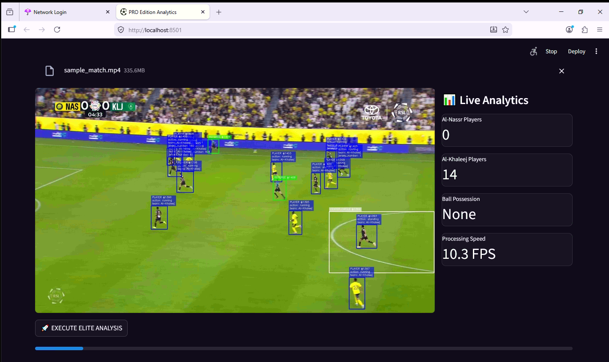
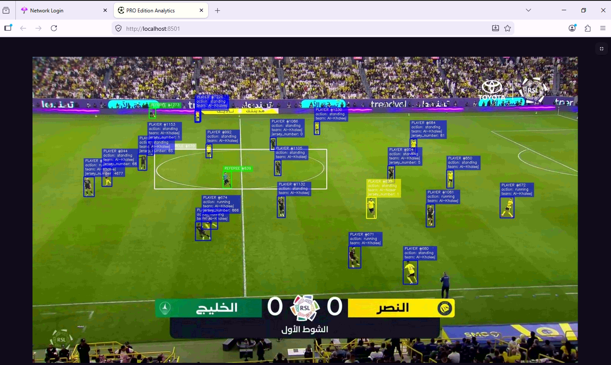
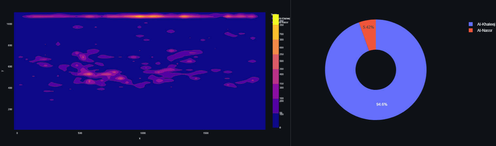
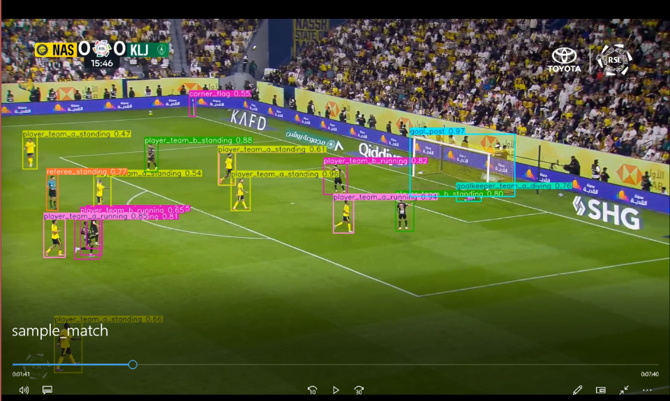

# ⚽ Real Time Football Match Analytics - PRO Edition


An elite, multi-stage Computer Vision pipeline designed for tactical football analysis. This system processes high-definition match footage to track players, classify teams, extract jersey numbers, and generate automated tactical intelligence using spatio-temporal heuristics.

## 🚀 Key Features & Research Implementation

### 1. Spatio-Temporal Kinematics (Speed & State)
Instead of relying on static frames, the system maintains a temporal memory of player centroids using ByteTrack. It calculates the Euclidean displacement across frames to dynamically classify physical states (Standing, Running, Sprinting).
$$d = \sqrt{(x_2 - x_1)^2 + (y_2 - y_1)^2}$$

### 2. Heuristic Action Recognition & Possession
Standard object detection cannot classify complex sports actions. This pipeline utilizes spatial proximity thresholds to deduce match events:
* **Ball Possession:** Calculated by finding the minimum Euclidean distance between the ball and all players. If $d_{min} < 60$ pixels, possession is granted.
* **Tackling:** Detected when players from opposing teams intersect within a dense proximity threshold ($d < 35$ pixels).
* **Passing/Shooting:** Triggered heuristically when a player in possession exhibits a sudden spike in ball-to-player distance (Ball Speed: Fast).

### 3. Automated Team Classification (Dynamic Thresholding)
Utilizes HSV color space masking to dynamically cluster players into their respective teams based on jersey colors. The pipeline employs an aggressive $5\%$ bounding box threshold to actively filter out pitch artifacts, grass, and dynamic stadium shadows.

### 4. Jersey Number Extraction & Pre-processing (OCR)
Integrates a robust `EasyOCR` pipeline utilizing a "Two-Brain" hardware split to prevent CUDA Out-of-Memory (OOM) errors. 
To ensure micro-text legibility from wide-angle HD broadcast footage, bounding box crops undergo rigorous OpenCV pre-processing before OCR execution:
* **Bicubic Upsampling:** Player crops are scaled $2x$.
* **Grayscale Conversion:** Forces high-contrast text extraction.
* **Temporal Modulated Sampling:** OCR fires selectively (every 30 frames) to maintain real-time application throughput (target: 25ms/frame).

### 5. Post-Match Tactical Analytics
Quantifies spatial dominance and match control.
$$\text{Possession Share (\%)} = \left( \frac{\text{Frames with Team Control}}{\text{Total Active Match Frames}} \right) \times 100$$

---

## 📸 System Output & Dashboard

### Live Inference Engine & Dashboard

*Real-time premium UI displaying live metrics, processing speed, and active ball possession.*


*Detailed tracking IDs, physical states, actions, and sleek native-style micro-text overlays.*

### Post-Match Tactical Intelligence

*2D Density contour mapping of player positions alongside calculated ball possession percentages.*

### Raw Model Detection Output

*Custom trained YOLOv8 model detecting players, goalkeepers, referees, goal posts, and corner flags.*

---

## 🛠️ System Architecture

1. **Input Layer**: Streamlit buffer supporting up to 1GB HD video footage with localized temporary storage routing and explicit I/O file-lock management (`WinError 32` protection).
2. **Detection Layer (GPU)**: Custom YOLOv8 weights aggressively utilizing available VRAM for primary object localization.
3. **Extraction Layer (CPU)**: EasyOCR offloaded to the main system processor to prevent VRAM overflow on 4GB hardware constraints.
4. **Spatio-Temporal Layer**: Heuristic engines calculating velocity, proximity, and action states.
5. **Visualization Layer**: Interactive Plotly charts and custom multi-line OpenCV overlays utilizing precise `FONT_HERSHEY_PLAIN` baseline math for native UI integration.

---

## 📦 Installation & Environment Setup

**⚠️ Critical Storage Note for Local Execution:**
This project utilizes large Machine Learning models (YOLOv8 + EasyOCR detection networks). To prevent `[Errno 28] No space left on device` errors on the system drive, the environment is strictly routed to a secondary drive (e.g., `D:\ocr_models`).

1. **Clone the repository:**
   ```bash
   git clone [https://github.com/distil-comedy/football-analytics-pro.git](https://github.com/distil-comedy/football-analytics-pro.git)
   cd football-analytics-pro